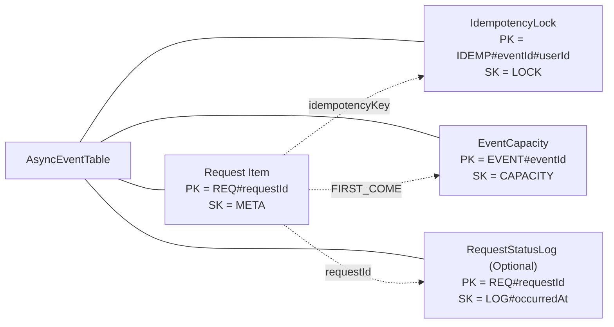

# DynamoDB Single Table Design

## Async Event Processing Data Model

---

## 1. Purpose

본 문서는 **트래픽이 집중되는 선착순·응모 이벤트 환경**에서

요청을 공정하고 안정적으로 처리하기 위해 설계한

**DynamoDB Single Table 데이터 모델**을 정의한다.

본 설계의 주요 목적은 다음과 같다.

- 요청 단위의 명확한 **상태 추적**
- `(eventId, userId)` 기준 **중복 요청 차단**
- 선착순 이벤트의 **정원(capacity) 원자성 보장**
- 사용자/운영자 화면을 고려한 **조회 패턴 최적화**
- 멀티 워커 환경에서의 **정확성과 일관성 유지**

---

## 2. Design Rationale

### 2.1 Why Single Table Design

본 시스템은 관계형 모델에서 중요한 **엔티티 간 관계 표현**보다,

다음 요소가 더 중요하다.

- 어떤 화면/API에서
- 어떤 기준(PK/GSI)으로
- 어떤 순서로 조회·갱신되는가

DynamoDB는 조인이나 외래 키를 제공하지 않기 때문에,

여러 테이블로 분리하는 방식보다는

**하나의 물리 테이블에 여러 역할의 아이템을 저장하고
PK/SK 패턴으로 의미를 구분하는 Single Table Design**이 적합하다.

---

## 3. Physical Table Definition

### AsyncEventTable

- **Billing Mode**: `PAY_PER_REQUEST`
- **TTL**: Item 단위 선택 적용

```
PK       : String
SK       : String

GSI1PK   : String
GSI1SK   : String

GSI2PK   : String
GSI2SK   : String

ttl      : Number (optional)

```

본 테이블은 요청, 멱등성 락, 정원 관리, 상태 로그 등

서로 다른 역할의 아이템을 함께 저장한다.

---

## 4. Logical Model (Single Table Items)

### Logical View



---

## 5. Core Entity: Request Item

### Key Structure

```
PK = REQ#requestId
SK = META

```

### Attributes

- `requestId`
- `eventId`
- `userId`
- `eventType` : FIRST_COME | LOTTERY
- `status`

### Status Lifecycle

```
RECEIVED
→ QUEUED
→ PROCESSING
→ SUCCEEDED | REJECTED | FAILED_FINAL

```

### Timestamps

- `requestedAt`
- `queuedAt`
    
    (SQS enqueue 성공 시각, 선착순 공정성 기준)
    
- `startedAt`
- `finishedAt`

### Failure Attributes (on failure)

- `failureClass`
- `errorCode`
- `errorMessage`

### Idempotency Key

```
idempotencyKey = IDEMP#eventId#userId

```

---

## 6. Global Secondary Index Design

### Design Principle

- GSI는 **Request Item에만 적용**
- 상태 로그, 멱등성 락, 정원 아이템에는 GSI를 부여하지 않음
- 상태(status)는 자주 변경되므로 **Sort Key에 포함하지 않음**

---

### GSI1: User-based Query

```
GSI1PK = USER#userId
GSI1SK = QAT#queuedAt#REQ#requestId

```

**Purpose**

- 사용자 “내 신청 내역” 화면
- 사용자가 생성한 요청을 **실제 큐 진입 순서**로 정렬 조회

---

### GSI2: Event-based Query

```
GSI2PK = EVENT#eventId
GSI2SK = QAT#queuedAt#REQ#requestId

```

**Purpose**

- 운영자 이벤트 분석
- 이벤트별 요청 흐름을 **공정성 기준 시각(queuedAt)** 기준으로 조회

---

## 7. IdempotencyLock Item

### Key Structure

```
PK = IDEMP#eventId#userId
SK = LOCK

```

### Behavior

- Conditional Put 사용
    
    ```
    attribute_not_exists(PK)
    
    ```
    
- 최초 요청만 성공
- 중복 요청 시:
    - 새로운 Request Item 생성하지 않음
    - 기존 `requestId` 반환

이를 통해 재시도 및 멀티 워커 환경에서도

중복 요청을 원자적으로 차단한다.

---

## 8. EventCapacity Item (FIRST_COME Only)

### Key Structure

```
PK = EVENT#eventId
SK = CAPACITY

```

### Attributes

- `capacityTotal`
- `capacityRemaining`
- `updatedAt`

### Behavior

- 조건부 업데이트: `capacityRemaining > 0`
- 성공:
    - capacity 감소
    - Request 상태 `SUCCEEDED`
- 실패:
    - Request 상태 `REJECTED (CAPACITY)`

본 방식은 멀티 워커 환경에서도

정확히 N명만 성공하도록 보장한다.

---

## 9. RequestStatusLog (Optional)

### Key Structure

```
PK = REQ#requestId
SK = LOG#occurredAt

```

### Usage

- 상태 변경 이력 기록
- 감사, 디버깅, 문제 분석 목적

### Design Decision

- GSI 미적용
- 필요 시에만 사용하여 인덱스 오염 방지

---

## 10. Summary

본 데이터 모델은 다음 요구사항을 충족한다.

- 요청 단위 상태 추적
- 중복 요청 차단
- 선착순 공정성 보장
- 사용자/운영자 조회 패턴 최적화

관계형 ERD가 아닌

**Access Pattern 중심으로 설계된 DynamoDB Single Table 모델**이며,

트래픽 집중 환경에서도 정확성과 운영 가능성을 유지하는 것을 목표로 한다.
